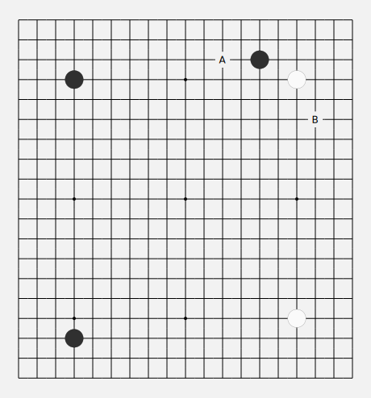

# react-goban

React goban (go game board) component.

```js
import React from 'react';
import { render} from 'react-dom';
import Goban from 'react-goban';

let white = 'W';
let black = 'B';

// initialize empty board
let data = [];
let labels = [];
for (let i = 0; i < 19; i++){
  data[i] = [];
  labels[i] = [];
}

// play some moves
data[3][3] = black;
data[3][15] = white;
data[16][3] = black;
data[15][15] = white;
data[2][13] = black;

// annotate
labels[2][11] = 'A';
labels[5][16] = 'B';

const App = () => (
  <Goban
    rows={19}
    cols={19}
    data={data}
    labels={labels}
    click={console.log}/> // accepts: (i, j) => { do something }
);

render(<App />, document.getElementById('root'));
```


## styles

default styles (can be overriden) by custom css:

```css
.line {
  fill: none;
  stroke: #000000;
  stroke-width: 1;
}

.keypointDot {
  fill: #000000;
  stroke: none;
}

.board {
  fill: #F2F2F2;
  stroke: none;
}

.whiteStone {
  fill: #FAFAFA;
  stroke: #888888;
  stroke-width: 0.3;
}

.blackStone {
  fill: #303030;
  stroke: #000000;
  stroke-width: 0.3;
}

.annotation {
  font-family: 'Roboto', sans-serif;
  font-weight: 100;
  font-size: 12px;
  cursor: default;
}

.light {
  fill: #FAFAFA;
}
```
